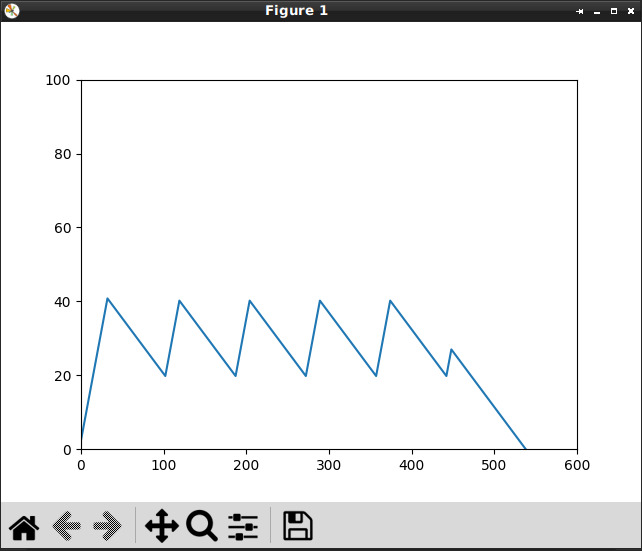

pycontrolflow examples
=====

# Basic

Very basic usage of the library.

```python
var_in = executor.memory("in", int, initial_value=0)
var_out = executor.var("out", bool)

executor.add([
    Changed[int](var_in).to(var_out),
])

var_in.set(1)
executor.run(datetime.datetime.utcnow())
print(var_out.get())  # -> False

var_in.set(1)
executor.run(datetime.datetime.utcnow())
print(var_out.get())  # -> False

var_in.set(2)
executor.run(datetime.datetime.utcnow())
print(var_out.get())  # -> True
```

# Water level

More advanced interactive example of using the library to control water pump. It also includes time check that allows
pump to run only in the specific time.

```python
water_level = executor.memory("current_level", float, 0)  # Memory cell holding current water level
pump_required = executor.var("pump_required", bool)  # Variable holding value if water level is too low
time_check_ok = executor.var("time_check_ok", bool)  # Variable holding value if pump can be enabled
pump_enabled = executor.var("pump_enabled", bool)  # Output variable determining if pump should be on

executor.add([
    SchmittGate(water_level, 20, 40, initial=True, invert=True).to(pump_required),
    TimeCheck(datetime.time(0, 0, 0), datetime.time(0, 7, 30)).to(time_check_ok),

    And(pump_required, time_check_ok).to(pump_enabled),
])
```

